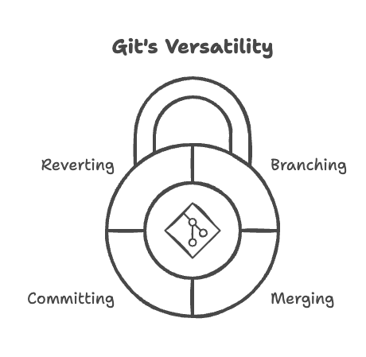

# Git Essential

<p align="center">
  
</p>

Welcome to the **Git Essential** repository! Here, we’ll explore the foundational concepts and key commands of Git, one of the most popular and powerful tools for version control.

# Table of Contents

1. [What is Git?](#what-is-git)
2. [What is Git used for?](#what-is-git-used-for)
3. [How to Use Git Simply](#how-to-use-git-simply)
4. [Essential Command Guide](#essential-command-guide)
6. [About the Author](#about-the-author)
7. [License](#license)

## What is Git?

Git is a distributed version control system created in [2005](https://github.com/git/git/commit/e83c5163316f89bfbde7d9ab23ca2e25604af290) by [**Linus Torvalds**](https://github.com/torvalds), the same developer behind the Linux kernel. The need for a secure, fast, and reliable version control system arose during the development of Linux itself. Git quickly gained prominence for its innovative features and the security it offers for handling change history.

## What is Git used for?

Git allows developers to track all changes made to a project’s code, making it easier to collaborate and integrate changes from different contributors. In addition to storing and managing different versions, Git provides tools to:

- Create independent branches for new features
- Merge changes across branches
- Store snapshots of code progress (commits)
- Revert changes and access the full project history

This versatility is essential for collaborative development and efficient code management.

## How to Use Git Simply

Getting started with Git can seem complex, but a few essential commands cover most needs:

- **Install Git**: [Git Downloads](https://git-scm.com/downloads)
- **Configure Git** (username and email):

   ```bash
   git config --global user.name "Your Name"
   git config --global user.email "youremail@example.com"
   ```

## Essential Command Guide (Organized by Usage Order)

### Setting Up a Repository

- **`git init`**: Initializes a new Git repository in the current directory.

- **`git remote add origin <repository-url>`**: Adds a remote repository to the local one with the name "origin." 

- **`git branch -M main`**: Renames the current branch to "main." The `-M` option forces the rename, moving the branch if necessary.

### Managing Files and Changes

- **`git add .`**: Adds all files and changes in the current directory to the staging area, preparing them for the commit.

- **`git commit -m "commit message"`**: Records the changes in the staging area with a descriptive message about what was modified.

- **`git commit --amend -m "rewritten_message"`**: Changes the message of the last commit. After using this command, sync with the remote using `git push --force-with-lease`.

### Synchronizing with Remote Repositories

- **`git clone <repository-url>`**: Clones a remote repository from GitHub to your local environment.

- **`git push -u origin main`**: Sends the commits on the "main" branch to the "origin" remote repository, setting "main" as the default branch for future push and pull commands. The `-u` option sets the upstream to simplify future push and pull commands.

- **`git pull origin main`**: Updates the local "main" branch with changes from the "origin" remote repository, combining `git fetch` and `git merge`.

### Advanced Change Management

- **`git fetch`**: Fetches updates from the remote repository without merging them into the current branch, updating remote references.

- **`git merge <branch-name>`**: Combines the changes from the specified branch into the current branch. For example, to merge a feature branch into `main`:

   ```bash
   git merge feature-branch
   ```

   This command applies the changes from the `feature-branch` to `main`, maintaining a clear history of commits. It’s particularly useful in workflows like the Feature Branch Workflow.

- **`git revert <commit-hash>`**: Creates a new commit that undoes the changes made by the specified commit, preserving the history. Useful for safely reversing changes without rewriting the history.

- **`git reset --hard <commit-hash>`**: Resets the repository to the state of the specified commit, deleting all changes made after that commit. Ideal for local use. To sync remotely, follow up with `git push --force-with-lease`.

- **`git cherry-pick <commit-hash>`**: Used to retrieve a specific commit. Example: Suppose you have two branches ("main" and "develop") and want to pick just one commit from "develop"; `cherry-pick` allows you to do this.

- **`git push --force-with-lease`**: A safer way to force-push local changes to the remote repository. It checks that no changes have been made by other collaborators, avoiding accidental overwrites.


## About the Author

This repository was created and is maintained by **Ciro Cesar Maciel**. I am a Software Engineer passionate about creating efficient and well-documented solutions. I am always looking for new tools and practices that can simplify and improve the development workflow.

In addition to this project, I have been working on other interesting projects related to automation, Artificial Intelligence (AI), browser extensions, and more. I am also beginning to teach what is necessary to learn Artificial Intelligence (AI), helping others to get started on their AI journey.

If you are interested in Software Development, Data Science, AI, or other tech topics, feel free to explore my GitHub profile and connect with me.

### How to Find Me:

- GitHub: [ciro-maciel](https://github.com/ciro-maciel)
- LinkedIn: [Ciro Cesar Maciel](https://www.linkedin.com/in/ciro-maciel/)
- Website: [ciro-maciel](https://www.ciro-maciel.click)

I am always open to new collaborations and projects. If you have an interesting idea or just want to exchange thoughts about development, don't hesitate to reach out!

## License

This project is licensed under the MIT License - see the [LICENSE](LICENSE) file for details.
